# PHP Agent Orchestrator for GitHub Copilot Chat

**A multi-agent orchestration toolkit for PHP projects — 8 specialized AI agents that research, plan, design, code, review, and test your PHP application.**

[](https://www.gnu.org/licenses/gpl-3.0)
[](https://www.php.net/)

---

## What is this?

This repository provides a set of **GitHub Copilot Chat Agent definition files** (`.github/agents/*.agent.md`) that turn GitHub Copilot into a coordinated team of specialized AI agents for PHP development.

Instead of a single general-purpose assistant, you get **8 core agents** with distinct roles — an Orchestrator that delegates work, a Researcher for deep analysis, a Planner that strategizes, a Designer for UI decisions, a Coder and FastCoder for implementation, a Reviewer for quality gates (with adversarial "devil's advocate" analysis), and a Tester for verification. Plus an **AutoConfig** utility agent that scans your project and auto-fills the configuration template.

The agents are **framework-agnostic** — they work with Laravel, Symfony, vanilla PHP, or any other PHP stack. You customize them for your project by filling in a single template file (`.github/copilot-instructions.md`).

### Key features

- **Multi-agent orchestration** — complex tasks are broken down and delegated to specialists
- **Deep research capability** — Researcher agent analyzes codebases, evaluates libraries, and maps dependencies
- **Security-first mindset** — every agent considers CSRF, XSS, SQL injection, ACL, and data isolation
- **Devil's advocate review** — Reviewer includes adversarial analysis beyond standard compliance checks
- **Framework-agnostic** — works with any PHP project via a customizable configuration template
- **Model diversity** — different AI models for different roles to catch blind spots
- **Quality gates** — mandatory code review and testing steps before shipping
- **Parallel execution** — independent tasks run concurrently for faster delivery
- **Escalation patterns** — FastCoder escalates to Coder when tasks are too complex
- **Zero-config start** — AutoConfig agent scans your project and fills in the configuration template automatically

---

## The Orchestration Pattern

```mermaid
graph TD
    User([👤 User Request]) --> Orchestrator

    Orchestrator --> Researcher
    Orchestrator --> Planner
    Orchestrator --> Designer
    Orchestrator --> Coder
    Orchestrator --> FastCoder
    Orchestrator --> Tester
    Orchestrator --> Reviewer

    Researcher -->|findings| Orchestrator
    Planner -->|plan| Orchestrator
    Designer -->|design spec| Orchestrator
    Coder -->|implementation| Orchestrator
    FastCoder -->|quick fix| Orchestrator
    FastCoder -.->|escalate| Coder
    Tester -->|test results| Orchestrator
    Reviewer -->|review verdict| Orchestrator

    Reviewer -->|NEEDS FIXES| Orchestrator
    Orchestrator -->|fix request| Coder
    Orchestrator -.->|re-test| Tester
    Orchestrator -.->|re-review| Reviewer

    Orchestrator -.->|findings / questions| User
    User -.->|accept / request fixes| Orchestrator

    Orchestrator --> Response([📋 Final Response])

    style Orchestrator fill:#4A90D9,stroke:#333,color:#fff
    style Researcher fill:#5C6BC0,stroke:#333,color:#fff
    style Planner fill:#7CB342,stroke:#333,color:#fff
    style Designer fill:#AB47BC,stroke:#333,color:#fff
    style Coder fill:#FF7043,stroke:#333,color:#fff
    style FastCoder fill:#FFA726,stroke:#333,color:#fff
    style Tester fill:#26A69A,stroke:#333,color:#fff
    style Reviewer fill:#EF5350,stroke:#333,color:#fff
```



### Agent roles at a glance

| Agent | Role | Writes Code? | Key Trait |
|-------|------|:---:|-----------|
| **Orchestrator** | Breaks down requests, delegates to specialists, coordinates results | ❌ | Never implements or analyzes — only delegates |
| **Researcher** | Deep codebase analysis, library evaluation, dependency mapping | ❌ | Evidence-based, thorough investigation |
| **Planner** | Identifies edge cases, produces implementation plans | ❌ | Verifies docs, considers security |
| **Designer** | Owns UX/UI decisions within the project's design system | ❌ | Usability + accessibility first |
| **Coder** | Implements features, fixes bugs, writes tests | ✅ | Follows repo conventions strictly |
| **FastCoder** | Executes simple, well-defined tasks quickly | ✅ | Speed — escalates if ambiguous |
| **Reviewer** | Code review + devil's advocate adversarial analysis | ❌ | Quality gate — finds problems + challenges assumptions |
| **Tester** | Writes and runs verification tests | ✅ (tests only) | Validates implementations |
| **AutoConfig** | Scans project and auto-fills `copilot-instructions.md` | ✅ (config only) | One-shot setup utility |

---

## Demo: See It in Action

> **"Pixel Dash: The Lost Coins"** — a retro-style 2D side-scrolling platformer built entirely in vanilla HTML, CSS, and JavaScript. No frameworks, no build tools, no external dependencies.
>
> Created with a **single prompt** using the orchestrator agent system to showcase what the multi-agent workflow can produce end-to-end.

🎮 **[Play the live demo](https://q3ok.github.io/copilot-agent-php-orchestrator/demo-platform-2d-game/)** · 📂 [Game repo branch](https://github.com/q3ok/copilot-agent-php-orchestrator/tree/platform-2d-game-test) · 📝 [Prompt used to create it](https://github.com/q3ok/copilot-agent-php-orchestrator/blob/platform-2d-game-test/PROMPT.md)

---

## Quick Start

### Prerequisites

- VS Code installed
- [GitHub Copilot Chat](https://marketplace.visualstudio.com/items?itemName=GitHub.copilot-chat) installed
- In the Copilot Chat panel, select **Agent** mode
- A PHP project with a writable `.github/` directory

---

### 1. Copy agent files

Copy the `.github/agents/` directory into your PHP project:

```bash
# From your project root
cp -r path/to/php-agent-orchestrator/.github/agents .github/agents
```

```powershell
# From your project root
Copy-Item -Path path\to\php-agent-orchestrator\.github\agents -Destination .github\agents -Recurse
```

Add `.github/tmp/` to your project's `.gitignore` — the Designer agent uses this directory to store large design spec files during orchestration:

```gitignore
# Agent runtime artifacts
.github/tmp/
```

### 2. Customize for your project

Copy the template:

```bash
cp path/to/php-agent-orchestrator/.github/copilot-instructions.md .github/copilot-instructions.md
```

```powershell
Copy-Item -Path path\to\php-agent-orchestrator\.github\copilot-instructions.md -Destination .github\copilot-instructions.md
```

#### Option A: Automatic configuration (recommended)

Let the **AutoConfig** agent scan your project and fill in the template automatically:

```
@autoconfig Scan this project and fill in .github/copilot-instructions.md
```

AutoConfig will analyze your `composer.json`, directory structure, config files, and codebase to detect your tech stack, architecture, conventions, and more. It produces a confidence report so you know which sections to verify.

> **Re-running**: If your project evolves (new framework version, added modules, changed architecture), simply invoke `@autoconfig` again. It will detect changes, update the configuration, and preserve your manual customizations.

#### Option B: Manual configuration

Edit `.github/copilot-instructions.md` — replace all `<!-- FILL IN: ... -->` markers with your actual values. See [`examples/`](examples/) for complete examples with Laravel, Symfony, and vanilla PHP.

### 3. Use in VS Code

Open your project in VS Code with GitHub Copilot Chat. The agents are automatically available. Invoke the Orchestrator for complex tasks:

```
@orchestrator Add a user profile page with avatar upload and email change functionality
```

Or invoke specific agents directly:

```
@researcher Analyze the current authentication system — what libraries, middleware, and patterns are used?
@planner Plan the implementation of a notification system
@coder Fix the pagination bug in the product listing
@reviewer Review all current git changes
```

---

## Agent Roles

### Orchestrator

The central coordinator. Receives user requests, breaks them into tasks, and delegates to the right specialist. Never writes code or analyzes code directly. Ensures proper workflow: Research → Plan → Design → Code → Test → Review.

**When to use**: Any complex request, multi-step tasks, or when you want the full orchestrated workflow.

### Researcher

Performs deep codebase analysis, external library evaluation, dependency mapping, and information gathering. Produces structured findings reports with evidence. Never writes code or plans.

**When to use**: Before planning complex features. When you need to understand the current codebase, evaluate library alternatives, or map dependencies.

### Planner

Produces structured implementation plans with security considerations, edge cases, and ordered steps based on Researcher findings and/or user request. Never writes code.

**When to use**: Before implementing complex features. When you need a strategy before coding.

### Designer

Owns UI/UX decisions. Produces design specs, layout decisions, and interaction patterns within the project's existing design system.

**When to use**: When building new UI, redesigning existing views, or making visual/interaction decisions.

### Coder

The primary implementation agent. Writes code following all repo conventions, security rules, and architectural patterns. Consults documentation for APIs and frameworks.

**When to use**: Feature implementation, bug fixes, refactoring, complex changes.

### FastCoder

A lightweight, fast implementation agent for simple, well-defined tasks. Requires clear specs. Escalates to Coder immediately if ambiguity is found.

**When to use**: Config changes, typo fixes, simple CSS, single-file edits under 5 minutes.

### Reviewer

Performs thorough code review against a comprehensive checklist covering security, architecture, logic, performance, and code quality. Includes an adversarial "devil's advocate" analysis that challenges assumptions and probes for edge cases beyond standard compliance. Never modifies code — only reports findings.

**When to use**: After implementation, before merging. Quality gate.

### Tester

Writes and runs verification tests for implemented changes. Covers security guards, edge cases, error handling, and regression scenarios. Never modifies production code.

**When to use**: After implementation, to verify changes work correctly.

### AutoConfig (utility)

A **one-shot utility agent** that scans your entire PHP project and auto-fills the `.github/copilot-instructions.md` template. Detects framework, architecture, naming conventions, security mechanisms, database setup, testing tools, and more.

**When to use**:
- **Initial setup** — instead of manually filling in the template, let AutoConfig do it for you.
- **Project evolution** — when your project changes (new framework version, added modules, changed architecture), re-run AutoConfig to update the configuration.

**Key features**:
- Analyzes `composer.json`, directory structure, config files, `.env`, Docker setup, CI configs, and actual source code.
- Provides **confidence levels** (HIGH / MEDIUM / LOW) for each detected section.
- Preserves manual customizations when re-run — only updates values that changed.
- Removes inapplicable optional sections automatically.
- Produces a detailed report of what was detected and what needs manual review.

```
@autoconfig Scan this project and fill in .github/copilot-instructions.md
```

---

## Customization Guide

### Project configuration (`copilot-instructions.md`)

The `.github/copilot-instructions.md` file is the single source of truth for your project's conventions. Every agent reads it as their "constitution." Key sections:

| Section | What to fill in |
|---------|-----------------|
| **Project Overview** | Name, PHP version, Docker usage |
| **Architecture** | MVC, DDD, hexagonal, etc. + layer flow |
| **Tech Stack** | Framework, template engine, CSS, JS, DB |
| **Security** | Auth, CSRF, XSS, SQL injection, ACL mechanisms |
| **Database** | ORM, migrations, repository conventions |
| **Testing** | Framework, directory, runner command |
| **Environment Setup** | Local dev setup, dependencies, required services |
| **Code Quality** | Static analysis (PHPStan, Psalm), code style (Pint, CS-Fixer) |
| **API** | REST/GraphQL style, response format, rate limiting |
| **Git Workflow** | Branch strategy, commit conventions, PR process |
| **Key Modules** | Main business domains and their locations in codebase |

### Adjusting models

Each agent file has a `model` field in the frontmatter. Defaults are sensible starting points, but adjust based on your preferences and budget:

```yaml
model: "Claude Opus 4.6"  # Example default from Orchestrator
```

### Adding MCP tools

If you use MCP tool servers (e.g., Context7 for API docs, Docker tools), add them to the `tools` list in the agent frontmatter:
Note: The Orchestrator requires all tools to be provided so it can supply them to subagents.
Register or pass every tool instance to the Orchestrator before creating subagents; otherwise subagents will not have access to required tools.

```yaml
tools: [vscode, execute, read, agent, search, web, todo, 'io.github.upstash/context7/*']
```

---

## Model Recommendations

| Agent | Default Model | Category | Why |
|-------|---------------|----------|-----|
| **Orchestrator** | `Claude Opus 4.6` | Strong reasoning | Must understand complex requests and coordinate multiple agents |
| **Researcher** | `Claude Opus 4.6` | Deep analysis | Needs to thoroughly analyze codebases, trace dependencies, evaluate libraries |
| **Planner** | `Claude Opus 4.6` | Deep analysis | Needs to synthesize research findings into actionable plans |
| **Designer** | `Gemini 3 Pro (Preview)` | Creative + analytical | Balances aesthetics, usability, and technical constraints |
| **Coder** | `GPT-5.3-Codex` | Strong coding | Complex implementations, multi-file changes, architecture |
| **FastCoder** | `GPT-5 mini` | Fast + free | Simple tasks; speed matters more than deep reasoning |
| **Reviewer** | `Claude Opus 4.6` | Thorough analysis | Must systematically check security, architecture, logic + adversarial analysis |
| **Tester** | `Gemini 3 Pro (Preview)` | Different perspective | Uses a different model than Coder to catch blind spots in test design |

### Cost considerations

These agents run on your **GitHub Copilot subscription**. The exact cost depends on your Copilot plan:

- **Copilot Individual / Business / Enterprise** — agent mode usage counts toward your Copilot premium requests allowance. Each agent call is one or more premium requests depending on model and context size.
- **Premium models** (Claude Opus 4.6, GPT-5.3-Codex) consume **more premium requests per call** than standard models.
- **Free models** (GPT-5 mini) consume **zero premium requests** — ideal for FastCoder and routine tasks. Budget-friendly models (Claude Haiku 4.5, GPT-4.1-mini) also consume fewer premium requests.

**Cost optimization tips:**
- Use free/fast models for FastCoder (e.g., `GPT-5 mini`) — zero premium request cost.
- Skip agents you don't need — the Orchestrator, Coder, and Reviewer trio is a solid minimal setup.
- For simple tasks, invoke `@coder` or `@fastcoder` directly instead of going through the full orchestration pipeline.
- Monitor your premium requests usage in GitHub Copilot settings.

> **Quality vs. cost trade-off:** The Orchestrator's decision gate has **no limit on re-review cycles** by design. If the Reviewer keeps finding issues, the Orchestrator will keep delegating fixes and re-reviewing until all findings are resolved. This prioritizes **maximum code quality** over token/cost efficiency. If you prefer to cap iterations, you can modify the decision gate logic in `Orchestrator.agent.md` (e.g., add a maximum of 2–3 re-review rounds before reporting to the user for manual decision).

> **Note:** Agent definitions themselves are free — they are just Markdown files. You only pay through your existing Copilot subscription when you actually invoke agents.

---

## Examples

Four complete example configurations are provided in [`examples/`](examples/):

| Example | Stack | Key features |
|---------|-------|-------------|
| [Laravel](examples/copilot-instructions-laravel.md) | Laravel 11, Eloquent, Blade, Tailwind, Pest | Sanctum auth, Spatie permissions, Sail, S3 storage |
| [Symfony](examples/copilot-instructions-symfony.md) | Symfony 7, Doctrine, Twig, Bootstrap 5, PHPUnit | Hexagonal architecture, Symfony Security, Messenger |
| [Vanilla MVC](examples/copilot-instructions-vanilla-mvc.md) | Custom MVC, Smarty 5, AdminLTE 3, custom repos | Front Controller, custom auth guards, CLI test scripts |
| [API-Only](examples/copilot-instructions-api-only.md) | Laravel 11, Sanctum, PostgreSQL, REST API | Headless API, Scribe docs, Action classes, no frontend |

---

## Project Structure

```
.github/
├── agents/
│   ├── AutoConfig.agent.md      # One-shot project scanner & config generator
│   ├── Orchestrator.agent.md    # Central coordinator
│   ├── Researcher.agent.md      # Deep analysis & information gathering
│   ├── Planner.agent.md         # Strategy & planning
│   ├── Designer.agent.md        # UX/UI decisions
│   ├── Coder.agent.md           # Implementation
│   ├── FastCoder.agent.md       # Quick tasks
│   ├── Reviewer.agent.md        # Code review + devil's advocate
│   └── Tester.agent.md          # Test writing & execution
└── copilot-instructions.md      # Template — customize for your project
examples/
├── copilot-instructions-laravel.md
├── copilot-instructions-symfony.md
├── copilot-instructions-vanilla-mvc.md
└── copilot-instructions-api-only.md
.gitignore
CHANGELOG.md
CONTRIBUTING.md
LICENSE                          # GPL v3
README.md
```

---

## FAQ

### Do I need all 8 agents?

No. The Orchestrator, Coder, and Reviewer are the core trio. You can remove agents you don't need. However, the full set provides the most robust workflow.

### Can I add my own agents?

Yes! Create a new `.agent.md` file in `.github/agents/` and add it to the Orchestrator's delegation templates. Follow the conventions in [CONTRIBUTING.md](CONTRIBUTING.md).

### Does this work with non-PHP projects?

The agents are designed for PHP, but the orchestration pattern is language-agnostic. You could adapt the agent files for any language by adjusting the instructions and `copilot-instructions.md` template.

### Which VS Code extension do I need?

[GitHub Copilot Chat](https://marketplace.visualstudio.com/items?itemName=GitHub.copilot-chat) with agent mode support.

### Can I use different AI models for different agents?

Yes — that's the intended design! Each agent has its own `model` field. Use expensive reasoning models for complex agents (Orchestrator, Planner, Reviewer) and fast, cheap models for simple ones (FastCoder).

### How does multi-tenancy work?

Multi-tenancy is optional. If your project is multi-tenant, fill in the Multi-Tenancy section in `copilot-instructions.md`. All agents will then enforce tenant scoping in their work. If not applicable, remove or leave that section empty.

### What if an agent makes a mistake?

The Reviewer agent is your safety net. It performs a structured code review with a comprehensive checklist. The Orchestrator won't accept changes that the Reviewer flags as CRITICAL or MAJOR.

### Do I have to fill in copilot-instructions.md manually?

No! Use the **AutoConfig** agent to scan your project and fill it in automatically:

```
@autoconfig Scan this project and fill in .github/copilot-instructions.md
```

AutoConfig detects your framework, architecture, naming conventions, database setup, testing tools, security mechanisms, and more. It provides a confidence report so you know which sections need manual verification.

### Can I re-run AutoConfig after my project changes?

Yes — AutoConfig is designed to be re-runnable. It compares the current codebase against the existing configuration, updates changed values (with comments marking what was updated), and preserves your manual customizations. Simply invoke `@autoconfig` again whenever your project evolves.

---

## Contributing

See [CONTRIBUTING.md](CONTRIBUTING.md) for guidelines on how to contribute — fork workflow, PR guidelines, and agent file conventions.

---

## License

This project is licensed under the **GNU General Public License v3.0** — see the [LICENSE](LICENSE) file for details.
